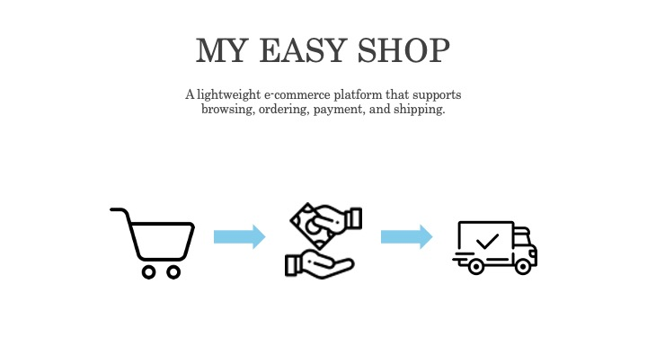
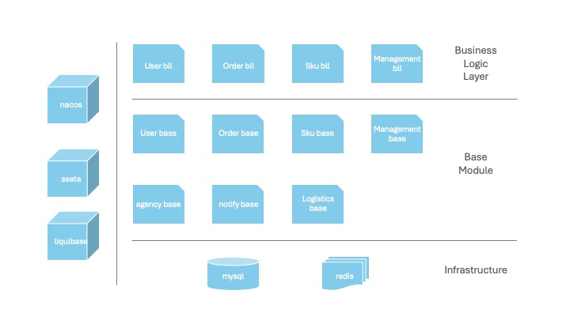

# My Easy Shop 2026



Josh's side project, a simple online store backend service developed in Java.
The main goal is to provide e-commerce functions such as browsing, ordering, payment, and shipping.

## Project Architecture

1. Document-first development based on OpenAPI code generator
2. Microservices architecture, with service discovery supported by Nacos and distributed transactions by Seata
3. SQL migration assisted by Liquibase

## Project Positioning

This project focuses on a document-first microservices system backend, emphasizing:
- OpenAPI-driven document-first development: Domain and controller are auto-generated from documents, reducing repetitive work in microservice integration
- Seata-driven distributed transactions: Non-intrusive distributed transactions, reducing manual handling of distributed transactions

## Core Features

- Product listing
- User login/logout
- Purchase products
- Redirect to third-party payment system
- Product shipping (in development)
- Purchase history query

## Tech Stack

- Language: Java (java 17)
- API: Spring Boot 3.1.5
- DB: MySQL + MyBatis Plus 3.5.3.2
- Cache: Redis
- Document: OpenAPI 3.0.3
- Service Discovery: Nacos 2.2.3
- Distributed Transaction: Seata 2.0.0
- Timed Task Management: XXL 2.4.0

## Project Structure



- Gateway Layer: Provides interfaces for external integration, handles permission verification, frontend data format, future plans include permission management, rate limiting, etc.
- Base Module: Handles business logic
- Platform Service: Provides platform internal management and support functions
- Infrastructure: Basic infrastructure

## Module Introduction

- nacos: Service discovery
- seata: Distributed transactions
- xxl: Timed task management
- sql-migration: Database migration based on Liquibase
- openapi: All API and data document definitions

- common-module: Shared packages and parent POM

- order-bll: Provides order and payment related API interfaces
- order-base: Order and payment related business logic implementation
- sku-bll: Provides product list related API interfaces
- sku-base: Product list related business logic implementation
- user-bll: Provides user registration and login related API interfaces
- user-base: User registration and login related business logic implementation
- management-bll: Provides manage products and update logistics info API interfaces
- management-base: Manage products and update logistics info business logic implementation
- logistics-base: Logistics related business logic implementation (in development)
- notify-base: Notification related business logic implementation
- agency-base: Provides external platform user purchase functionality (not developed)

## Project Folder Structure

```text
src/main/java/{package}/
  common/         # Project aspects and package settings
  controller/     # Controller implementation (path definitions from OpenAPI code generator)
  mapper/         # Data access (data definitions from OpenAPI code generator)
  service/        # Business logic implementation

target/generated-sources/openapi/src/main/java/{package}
  api/            # Auto-generated path definitions from OpenAPI code generator
  model/          # Auto-generated data definitions from OpenAPI code generator
```

## Quick Start (Local)

1. Set up infrastructure
   - Set up MySQL 8 on port 3311, account root password 123456
   - Set up Redis 7 on port 6379, no SSL, password 123456

2. Start platform service
```sh
# nacos
cd nacos
mvn -Prelease-nacos -Dmaven.test.skip=true clean install -U 
cd distribution/target/nacos-server-2.2.3/nacos/bin
sh startup.sh -m standalone
## After setup, log in to the backend to check if successful http://127.0.0.1:8848/nacos/

# liquibase
cd sql-migration
make sku
make agency
make user
make order
make xxl
make management
make logistics
make seata

# seata
cd seata
mvn -Prelease-seata -Dmaven.test.skip=true clean install -U 
cd distribution/target/seata-server-2.0.0/seata/bin/
PSR_NACOS=127.0.0.1:8848  MYSQL_PATH=127.0.0.1:3311  MYSQL_DATABASE=seata MYSQL_USER=root MYSQL_PASSWORD='123456' sh seata-server.sh -h 127.0.0.1 -p 8091 -m db
## After setup, log in to the backend to check if successful http://localhost:7091/ account seata password seata

# xxl
cd xxl
mvn clean install
cd xxl-job-admin
mvn package
docker build --no-cache . -t xxl-job-admin:2.4.0
docker compose up -d
## After setup, log in to the backend to check if successful http://localhost:8056/xxl-job-admin/ account admin password 123456

```

3. Build all modules
```sh
git clone --recurse-submodules <url> # Clone with submodules

cd <module>
mvn clean generate-sources # Generate code

mvn spring-boot:run -Dspring-boot.run.arguments="--spring.config.additional-location=src/main/resources/application-local.yml --spring.profiles.active=local"
```

## Notes

This is Josh's 2026 side project, with limited time, many features are not completed
